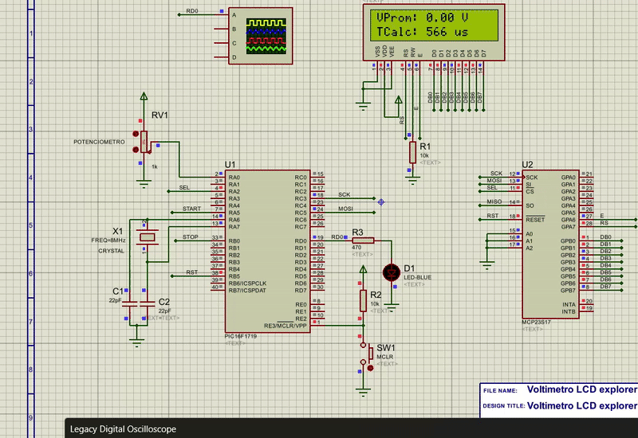

# MuestreoPic16f1719
Este proyecto realiza la media movil de 10 muestreos analógicos provenientes de la lectura de un potenciometro, y obtiene el tiempo de cálculo de la media móvil para cada conversión ADC.

## Demostración de funcionamiento

